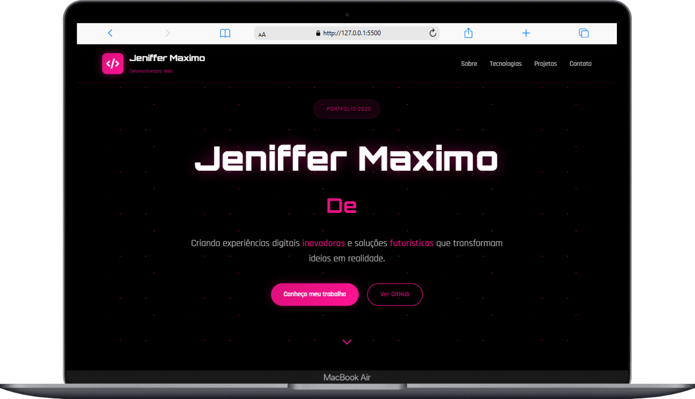

# 🌐 Portfólio - Jeniffer Maximo

Este é o meu portfólio pessoal desenvolvido para apresentar minhas habilidades, tecnologias, projetos e formas de contato de maneira moderna e interativa.  
O design segue um estilo **futurista** com cores neon, animações e responsividade para garantir uma ótima experiência em qualquer dispositivo.  

---

## 🚀 Demonstração
🔗 **Acesse o portfólio online:** [Clique aqui](https://jeniffer-mxm.github.io/Meu-Portifolio/) 


---

## 🖼️ Preview


---

## 📂 Estrutura do Projeto

```bash
├── index.html        # Estrutura principal do site
├── styles.css        # Estilos e design futurista
├── script.js         # Funcionalidades e interatividade
└── img/              # Imagens utilizadas (perfil, projetos, etc.)
```
🛠️ Tecnologias Utilizadas

HTML5 → Estrutura semântica do site

CSS3 → Layout responsivo, animações e efeitos neon

JavaScript (Vanilla) → Interatividade, animações e carregamento dinâmico

Font Awesome → Ícones para navegação, tecnologias e redes sociais

Google Fonts (Orbitron & Rajdhani) → Tipografia moderna

📑 Funcionalidades

✅ Navbar Fixa com menu responsivo (hamburguer menu)
✅ Animação de digitação para o cargo na seção Hero
✅ Scroll suave entre seções
✅ Cards animados para tecnologias, projetos e redes sociais
✅ Lazy Loading de imagens para melhor performance
✅ Design 100% responsivo para desktop, tablet e mobile
✅ Service Worker (PWA-ready) para futura instalação como app

🖥️ Seções do Portfólio

Hero – Apresentação principal, botão para rolar para a seção Sobre

Sobre Mim – Foto, descrição, valores e habilidades

Tecnologias – Tecnologias dominadas com ícones e animações

Projetos – Cards de projetos com imagem, descrição e link

Contato/Redes Sociais – Links diretos para WhatsApp, LinkedIn, Instagram, GitHub


📌 Melhorias Futuras

 Adicionar modo escuro/claro com toggle

 Criar animações ainda mais interativas com GSAP ou Framer Motion

 Adicionar versão multilíngue (PT/EN)

 Integrar formulário de contato funcional via API

📬 Contato

📧 Email: jenifferamax@gmail.com

💼 LinkedIn: linkedin.com/in/jeniffermaximo


📝 Licença

Este projeto é de uso pessoal e está disponível apenas para fins de aprendizado e demonstração.
Você pode se inspirar no design, mas não copie diretamente sem permissão.
